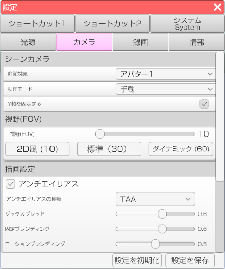

## カメラタブについて

>シーンカメラの設定を行います。

### シーンカメラ

>・「追従対象」のドロップダウンからどのアバターを中心にカメラを動かすか設定します。
>・「動作モード」のドロップダウンからどのようにカメラを動作させるか設定します。
>・「Y軸を固定する」のチェックを入れると「動作モード」が手動以外の時にカメラの縦方向への移動を制限します。

### 視野 (FOV)

>FoVを変更することが出来ます。（設定範囲は10～60）

### 描画設定 (FREE 版は非対応)

#### アンチエイリアス

>チェックを入れることでアンチエイリアスをかけることが出来ます。
>アンチエイリアスとはジャギーを軽減させ色を滑らかに変化させる画像処理です。
>「アンチエイリアスの種類」のドロップダウンからアンチエイリアスの種類を変更することが出来ます。
>アンチエイリアスの種類はFXAA, SMAA,TAAの3種類があります。

#### 光のぼかし

>チェックを入れることで光のぼかし(ブルーム)をかけることが出来ます。
>ブルームとは明るい光源から物体を囲むように漏れ出る光による光学的なエフェクトです。

#### 色調補正

>チェックを入れることで色調補正(カラーグレーディング)をかけることが出来ます。
>カラーグレーディングとは色彩を補正する編集効果です。

#### 陰影

>チェックを入れることで陰影をかけることが出来ます。

#### 色のにじみ

>チェックを入れることで色のにじみをかけることが出来ます。

#### ピント

>チェックを入れることでカメラのピントを調節することが出来ます。

#### 粒上ノイズ

>チェックを入れることで粒上ノイズを発生させることが出来ます。

#### トンネル効果

>チェックを入れることでトンネル効果を発生させることが出来ます。

