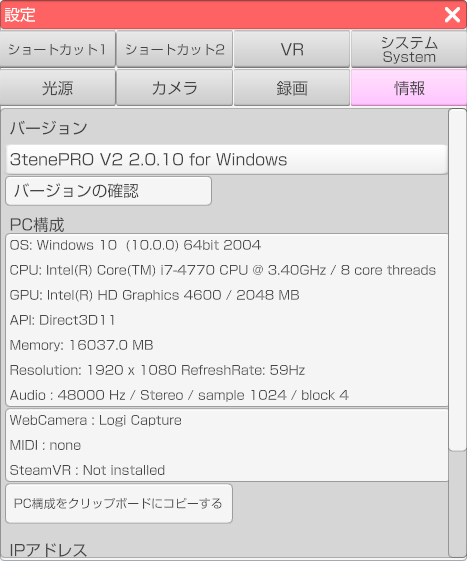

## 情報タブについて

>3tene および PC の情報が表示されます。

### PC構成

>使用している PC (Mac) の構成を表示します。
>3tene に関してのお問い合わせを行う場合はこちらの情報が必要になります。

>「PC構成をクリップボードにコピーする」ボタンをクリックすると、
>表示されている文章を他のソフトウェアに「貼り付け」が可能になります。

### IPアドレス

>使用している PC に設定されているIPアドレスを表示します。
>※ 3teneFREE では表示されません。

>3teneFT (iPhoneX 以降) 連携でフェイストラッキングを行う場合は、
>表示されている IP アドレスを 3teneFT に入力してください。
>使用している PC によっては複数表示される場合があります。
>複数ある場合には該当するネットワークのIPアドレスを１つ入力してください。

