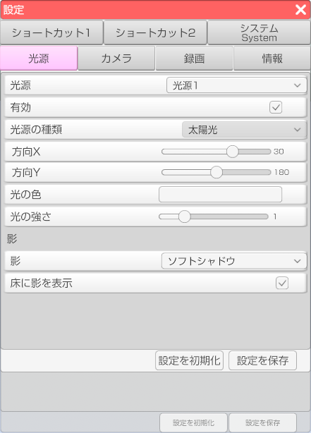

## 光源タブについて

>光源の設定を行います。

### 光源の設定
>・「光源」のドロップダウンから設定を変更する光源を選択します。
>・「有効」のチェックボックスにチェックを入れると該当の光源が有効になります。
>・「光源の種類」のドロップダウンから光源の種類を設定することが出来ます。
>光源の種類は太陽光、スポット、ポイントの3種類です。
>・「方向〇」のスライドで光源の角度を変更することが出来ます。※光源の種類によってない場合が有ります。
>・「位置〇」のスライドで光源の位置を変更することが出来ます。※光源の種類によってない場合が有ります。
>・「光の色」で光の色をカラーピッカーで変更することが出来ます。
>・「光の強さ」のスライダーで光の強さを変更することが出来ます。

### 影の設定
>・「影」のドロップダウンから影のタイプを変更することが出来ます。
>影の種類は、なし、ハードシャドウ、ソフトシャドウの3種類です。
>・「床に影を表示」にチェックを入れるとデフォルトの床に影が表示されます。

