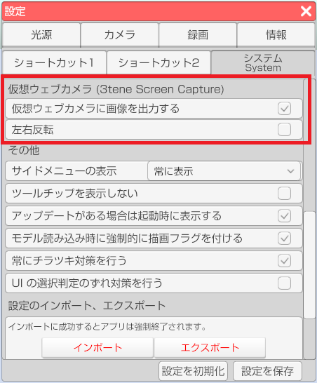

## 仮想ウェブカメラについて

>Windows 版の 3tene は 3tene Screen Captureという
>仮想ウェブカメラ機能を標準搭載しています。
>※Mac版は対応していません。

>仮想ウェブカメラを使うと 3tene の画面をウェブカメラ映像として利用する事が可能になります。
>メニューやウェブカメラプレビュー等の2D画像は出力されません。

### 注意事項

>3tene インストール後に 3tene のフォルダを移動する と
>「3tene Screen Capture」が動作しなくなります。
>この問題を解決するには、フォルダを元に戻すか、
>手動による「3tene Screen Capture」の再登録が必要になります。
>※登録および解除には管理者権限が必要となります。

>※Steam 版はインストーラが無いので仮想ウェブカメラが自動登録されません。
>　下記の「3tene Screen Capture」の再登録の仕方を参照してください。

>OBS Ver 29.1.0 で古い仮想ウェブカメラを拒否する実装が行われ、
>OBS Ver 29.1.0 以降で映像キャプチャを使用する場合は
>3tene v3.0.8 以降の 「3tene Screen Capture」 が必須となりました。
>※古い NVIDIA GeForce ドライバも OBS での動作不安定の原因となります。

>Windows11 の「スマート アプリ コントロール」が有効になっていると
>dll ファイルの読み込みがブロックされ、正常に動作しなくなる可能性があります。
>Microsoft <a href="https://support.microsoft.com/ja-jp/topic/%E3%82%B9%E3%83%9E%E3%83%BC%E3%83%88-%E3%82%A2%E3%83%97%E3%83%AA-%E3%82%B3%E3%83%B3%E3%83%88%E3%83%AD%E3%83%BC%E3%83%AB%E3%81%A8%E3%81%AF-285ea03d-fa88-4d56-882e-6698afdb7003" target="_blank">スマート アプリ コントロールとは</a>

>3tene Ver 2.0.5 以前では UnityCapture を使用していましたが、
>Ver 2.0.6 以降では 3tene Screen Capture を使用するようになっています。

### 「3tene Screen Capture」の再登録の仕方

>3tene がインストールされたフォルダの中に存在する
>「3teneScreenCapture」フォルダを開きます。
>C:\Program Files\PLUSPLUS\3tene〇〇〇

>Steam 版のデフォルトのインストールフォルダは下記になります。
>C:\Program Files (x86)\Steam\SteamApps\Common\3tene\3tene
>※Steam のインストール方法や設定によっては異なる場合があります。

>フォルダの中にある「install.bat」を右クリックし、
>表示されるメニューから「管理者として実行」を選択して実行します。
>※Windows の保護が表示された場合は「詳細情報」をクリック後、
>「実行」を選択してください。

>「デバイスの変更の許可」が表示されるので「はい」を選択してください。

>登録成功が表示されエラーが出なければ登録完了です。

>3tene を再起動すると、画面が「3tene Screen Capture」に出力されるようになります。

### 仮想ウェブカメラの使用方法
>設定 - システム - 仮想ウェブカメラ の「仮想ウェブカメラに画像を出力する」に
>チェックを入れると仮想ウェブカメラを使用することが出来ます。
>左右も反転する事が可能です。

### 仮想ウェブカメラの特徴

>ウェブカメラ対応のソフトウェアに 3tene の画面を表示させる事が可能になります。
>OBS (配信ソフト)や、ZOOM（ミーティングソフト）等、いろいろな用途に使えます。

>ウェブカメラ一覧で「3tene Screen Capture」を選択してください。

>また、仮想ウェブカメラに出力される画像は 3tene 画面内にあるメニューやウインドウが
>対象とならないのでアバターと背景のみが表示されます。

### 仮想ウェブカメラを OBS で使用する

[OBS との連携について](#AboutOBS.md) を参照してください。

### 「3tene Screen Capture」のソフトウェア相性について

>仮想ウェブカメラは OBS と ZOOM にて動作確認をしていますが、
>一部のウェブカメラ対応ソフトではウェブカメラとして認識せず、
>「3tene Screen Capture」が表示されない可能性があります。
>※認識しない場合はウェブカメラ対応ソフトに問い合わせてください。

