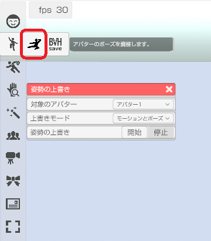
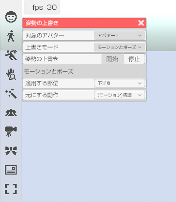
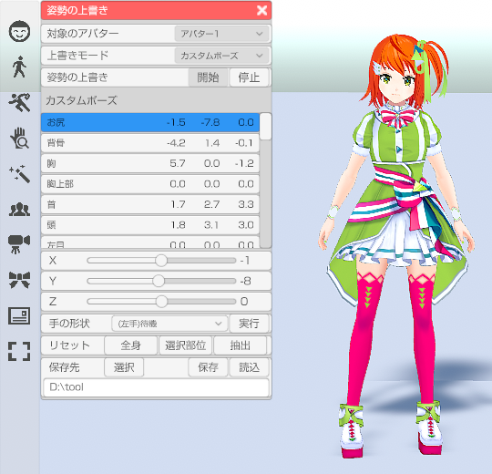

## ボーン オーバーライド(VRM)について

>モーションやポーズ、トラッキングを組み合わせて使えます。  
>\
>組み合わせを設定する「モーションとポーズ」と  
>ポーズエディタ機能を提供する「カスタム・ポーズ」があります。

### メニューから選択

>

### モーションとポーズ

>上書きを行う部位を指定します。  
>\
>下半身に座るポーズや走るモーションを設定することで、  
>アバターの上半身だけをトラッキングで動かす事が可能です。  
>\
>
>
>#### 適用する部位
>上書きをする部位を指定します。  
>
>#### 元にする動作
>適用する部位で下半身を指定し、動作に「走る1」や「椅子に座る」を設定すると、  
>走ったり座ったりしながらトラッキング等を行う事ができます。

### カスタム・ポーズ

>変更したい部位をリストから選択し、  
>回転ＸＹＺを調整してポーズを作成します。  
>※指を扱う場合はアバター調整「基本」の BVH の「指を操作する」を有効にしてください。  
>\
>
>
>#### 手の形状
>プリセットされた手の形状に変更します。  
>指は操作する前に目的の形状に近い状態にしてからの編集をお勧めします。
>
>#### リセット
>全ての回転をリセット(ゼロ)にします。  
>モデルはＴポーズになります。
>
>#### 保存先
>保存ボタンを押した時にポーズが保存されるフォルダを指定します。  
>読み込みボタンを押すと指定されたフォルダからファイルを読み込む事ができます。
>
>#### ポーズの保存データ
>ポーズは BVH 形式で保存されます。  
>3tene のモーションフォルダにコピーする事で作成したポーズを実際に使用できます。  
>他の VRM 対応ソフトウェアで BVH に対応していれば作成したポーズを  
>読める可能性はありますが、サポート外となります。

