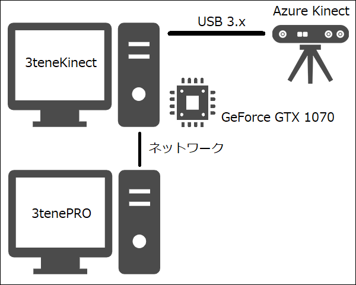

## Azure Kinect について (モーションアプリ連携)

>深度カメラと機械学習データを合わせてボディトラッキングを行います。
>機械学習の扱いには高性能な GPU が必要となります。

>[モーションアプリのダウンロードの仕方](#download3tene.md)

### Azure Kinect の要求スペック

>Azure Kinect でボディトラッキングを使用する為には高性能PCが必要になります。

>・ＣＰＵ：第7世代 Core i5 クアッドコア 2.4GHz 以上
>・メモリ：4GB 以上
>・ＧＰＵ：NVIDIA GeForce GTX 1070 以上
>・接続：USB 3.x 必須。（USB 2.0 では Kinect を認識しません。）

>GPU は CUDA モードで動作する NVIDIA 製 GeForce シリーズが推奨となります。

>3teneKinect 1.0.3 以降で GeForce シリーズを使用する場合は
>ドライバ・バージョン R455 以降をインストールする必要があります。

>Intel の ＣＰＵ内蔵グラフィック（6000 番台以降）、AMD 製の Radeon シリーズは
>DirectML モードで動作すると思われますが動作確認をしていません。
>DirectML の利用には対応デバイスとドライバソフトウェアが必至となります。

><a href="https://docs.microsoft.com/ja-jp/azure/kinect-dk/system-requirements" target="_blank">公式：Azure Kinect 要求機能（英語）</a>

>「Visual Studio 2015 の Visual C++ 再頒布可能パッケージ」のインストールが別途必要です。
><a href="https://docs.microsoft.com/ja-jp/azure/kinect-dk/body-sdk-setup" target="_blank">公式：開発者向けクイックスタート</a>

### 注意事項

>・黒い衣服を着ていると認識率が低下します。
>・現在のバージョンは複数人の認識に対応していません。（必ず１人だけ写るようにしてください。）

### 3teneMoApp_Kinect について

>※初代 Kinect および Kinect V2 には対応していません。

>3tene(PRO, STUDIO) で Azure Kinect を使用する為には
>別途 3teneKinect が起動している必要があります。

>3teneKinect は日本語が含まれるパスに配置しないでください。
>プレビューが真っ白の状態になり、正常動作しません。

>3teneKinect が Azure Kinect の制御および管理を行い、取得した認識データを
>3tenePRO(Studio) に送信する事でアバターに動きを反映させています。

>3teneKinect 1.0.3 では AzureKinect DK の
>Sensor-SDK 1.4.1、 BodyTracking-SDK 1.1.0 を使用して作成されています。

>認識する部位は頭、腕、手、腰、足となりますが指は親指と人差し指のみとなります。
>指の認識ではブレが発生しやすい為、3teneKinect では指の制御機能を用意しています。

>3teneKinect は 3tenePRO のダウンロードと同じく、
><a href="https://www.3tene.com" target="_blank">3tene 公式サイト</a>のマイページよりダウンロードできます。

>PC 1台で構成する場合は下記になります。
>

### Azure Kinect の操作手順

>1. 3tene を起動する。
>2. 3teneMoApp_Kinect を起動する。
>3. 3teneMoApp_Kinect で Azure Kinect の制御を開始する。
>
>4. 3tene でボディトラッキングを 3tene モーションアプリ に設定します。
>
>5. 3tene のトラッキングを開始します。
>

>必ず 3teneMoApp_Kinect の制御を開始した後に 3tene のトラッキング開始を行ってください。

### 3teneKinect の開始に失敗する場合

>下記の内容を再度確認してください。
>・Kinect が USB 3.0 以降の端子に接続されている。（主に青い USB 端子）
>・3teneMoApp_Kinect が日本語を含んだパスで実行されてないか。

>特に問題がみつからない場合は Windows の環境変数に設定を追加する事で
>Kinect からのログ出力を保存し、原因を解析する事が可能になります。

>設定 → システム → 詳細情報 → システムの詳細設定 → 環境変数

>

>上記のように設定を行うと実行ファイルと同じパスに
>k4a.log と k4abt.log が出力されるようになります。

|変数名|設定値|備考|
|---|:---:|:---|
|K4A_ENABLE_LOG_TO_A_FILE|k4a.log|センサー API のログ出力ファイル名|
|K4A_LOG_LEVEL|w|ログ出力の警告レベル。 c, e, w, i, t|
|K4ABT_ENABLE_LOG_TO_A_FILE|k4abt.log|ボディトラッキング API のログ出力ファイル名|
|K4ABT_LOG_LEVEL|w|ログ出力の警告レベル。 c, e, w, i, t|

>また、Windows の管理者権限による問題で、
>使用している PC の Windows アカウントが管理者権限を持つ場合は上記の手順を行えばログは出力されますが、
>管理者権限を持たない場合は上記の手順を行ってもログは出力されませんので、
>下記のようにシステム環境変数の欄に設定を追加してください。

>

>ただ、Kinect アプリを起動中に環境変数の変更を行ってもログの出力はされませんので
>もし起動している場合は変更後に一度アプリを閉じて再び開くか、それでも出力されない場合は PC を再起動してください。

### 3teneMoApp_Kinect の設定項目

>

>#### 演算ユニット
>認識処理で使用する API を指定します。
>GPU ： グラフィックボード（GPU）を使用します。
>CPU ： ＣＰＵを使用します。（処理が重すぎて速度がほぼ出ません。）
>CUDA ： CUDA を使用します。（GeForce が必須となります。）
>DirectML ： DirectML を使用します。（GeForce 以外でも動作します。）

>#### 深度モード
>NFOV 2x2 Binned ： 奥行き重視。75度、0.5～5.46m、最大30fps
>NFOV Unbinned ： 奥行き重視。75度、0.5～3.86m、最大30fps、高解像度
>WFOV 2x2 Binned ： 広さ重視。120度、0.25～2.88m、最大30fps
>WFOV Unbinned ： 広さ重視。120度、0.25～2.21m、最大15fps、高解像度

>#### モデル
>パペット ： 認識結果をパペットに反映させます。認識結果をそのまま反映します。
>みとね ： VRM モデルに認識結果を反映させます。3teneで表示させた場合の確認用です。
>両方 ： パペットと VRM モデルを表示します。

>#### 位置Ｚ
>モデルの位置を調整します。

>#### 補間の強さ
>認識結果に対して補間を行います。強めにすると細かいブレが抑えられます。

>#### 手首を制御する
>手首に認識結果を反映するかを指定します。
>手首のブレが激しい場合にはオフにしてください。（手首は動かなくなります。）

>#### 指（親指以外）を制御する
>指に認識結果を反映するかを指定します。
>指のブレが激しい場合にはオフにしてください。（指は動かなくなります。）

>#### 親指を制御する
>親指に認識結果を反映するかを指定します。
>親指のブレが激しい場合にはオフにしてください。（親指は動かなくなります。）

>#### 頭の角度　角度X
>頭の角度を調整します。
>トラッキングを開始した際、正面を向いた状態でアバターの顔の角度が正常でない場合は調整を行ってください。

### PCを2台以上の構成で扱う

>3tene(PRO, STUDIO) と 3teneMoApp_Kinect を別々のPCで動かして利用する事が可能です。
>Azure Kinect 用の高性能 PC を別途用意する事で負荷分散も行えます。
>※β版で分散機能は提供されません。

>

>3teneMoApp_Kinect の IP アドレスを確認して 3tene 側の AzureKinect の IPアドレスに設定します。
>※１台構成に戻す場合は IPアドレスを 127.0.0.1 に設定してください。

>

>※セキュリティソフトのファイアウォールによって
>　3teneKinect の通信がブロックされる場合があります。
>　ブロックされると接続ができないのでセキュリティの設定変更が必要です。

>ファイアウォールを完全無効にして接続を確認する事も可能ですが、
>セキュリティ上、大きな問題となる為、接続確認が取れた場合は
>速やかにファイアウォールの設定を戻してください。
>通常使用ではセキュリティソフトに「3teneKinect をブロックしない設定」を追加してください。

>後は１台構成の場合と同じ手順で 3teneMoApp_Kinect の制御を開始した後に、
>3tene のトラッキングを開始します。

