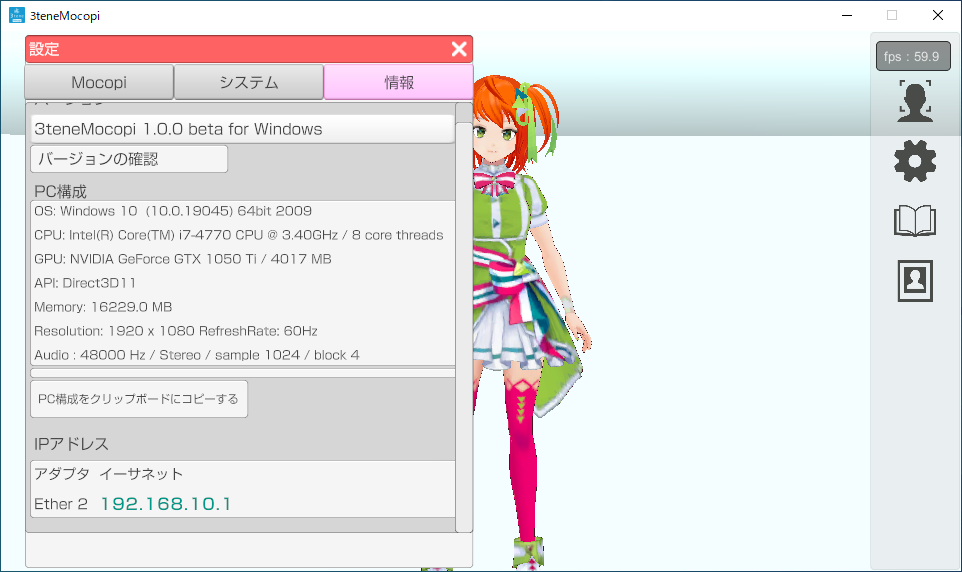
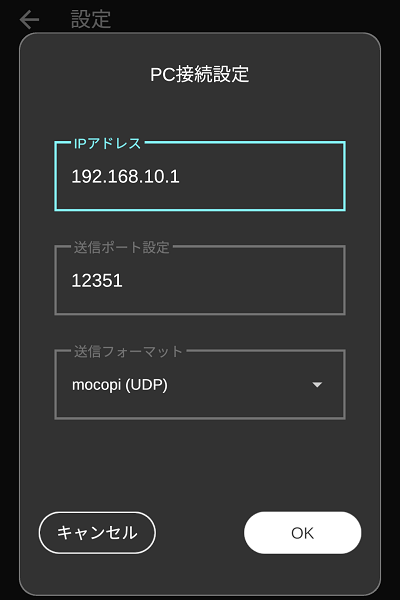
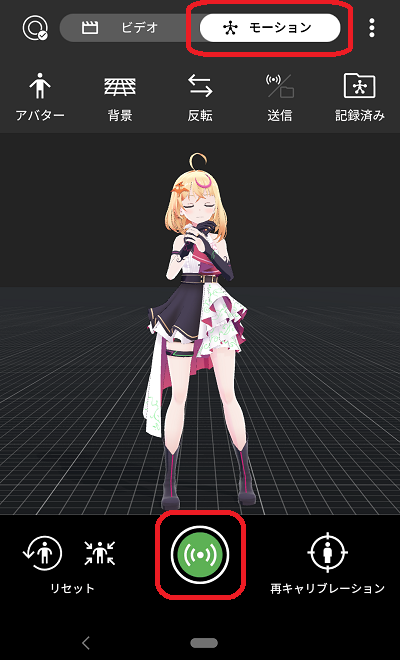

## mocopi (モーションアプリ連携)

>専用センサーで頭、体、腕、足を動かします。

>[モーションアプリのダウンロードの仕方](#download3tene.md)

### mocopi 専用アプリについて

>mocopi の利用にはmocopi 専用アプリ対応のスマートフォンが必要になります。
>
>

>お使いのスマートフォンが mocopi 専用アプリに対応しているかどうかは
><a href="https://www.sony.jp/mocopi/#spec" target="_blank">mocopi 公式ホームページ</a>にて確認をお願いします。

>※一覧にある機種よりも古いスマートフォンに専用アプリがインストールできても
>　性能が足りず安定動作しない可能性が高いです。

### 使い方

>mocopi を利用するには下記の手順で進める必要があります。
>1. スマートフォンに専用アプリをインストールし、mocopi が動作するのを確認する。
>専用アプリでの動作については mocopi 公式の<a href="https://www.youtube.com/watch?v=g0d-x0l2HtA" target="_blank">動画</a>などを参照して設定をしてください。

>2. 3teneMoApp_Mocopi をインストールしたPCとスマートフォンをWiFi接続して動作するのを確認する。
>※セキュリティソフトによってブロックされ、通信できない場合があります。
>その場合にはファイルウォールの確認をお願いします。
>[セキュリティソフトについて](#AboutSecuritySoft.md)

>3teneMoApp_Mocopi の設定「情報」に表示されている IP アドレスを mocopi 専用アプリに入力します。

>専用アプリの操作 → 設定 → PC接続設定 → IPアドレス入力 → OK

>3teneMoApp_Mocopi のトラッキングを開始した状態で専用アプリから送信を行うと
>アバターが動作するようになります。

>専用アプリの操作手順
> → 上部の「モーション」をタップ → 下部の中央にある送信アイコンをタップ

>3. 3tene と 3teneMoApp_Mocopi を接続して動作するのを確認する。
>モーションアプリの動作確認後に 3tene と連携接続を行って使用します。
>[モーションアプリについて](#bt_MotionApp.md)

