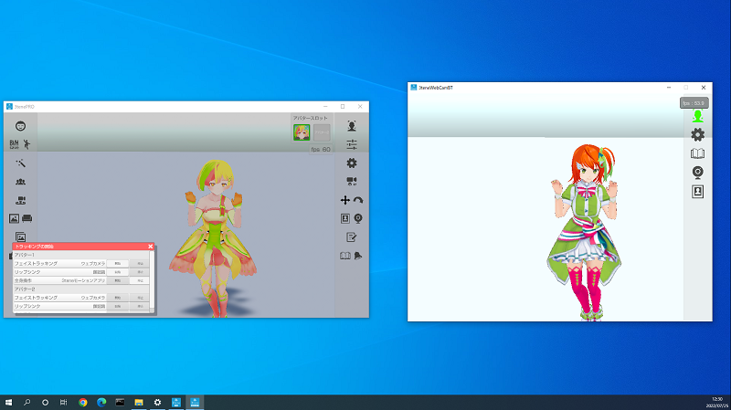

## ウェブカメラ ボディトラッキング (モーションアプリ連携)

>ウェブカメラでボディトラッキングを行います。

>高性能 GPU が必要になりますので注意してください。
>※GeForce GTX 1070, 2060, 3050 以上の性能が必要。

>[モーションアプリのダウンロードの仕方](#download3tene.md)

### 使い方

>詳細は準備中。
>

>モーションアプリの動作確認後に 3tene と連携接続を行って使用します。
>[モーションアプリについて](#bt_MotionApp.md)

