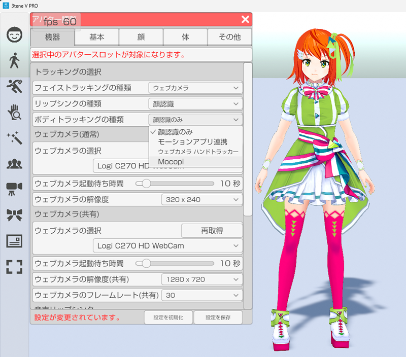
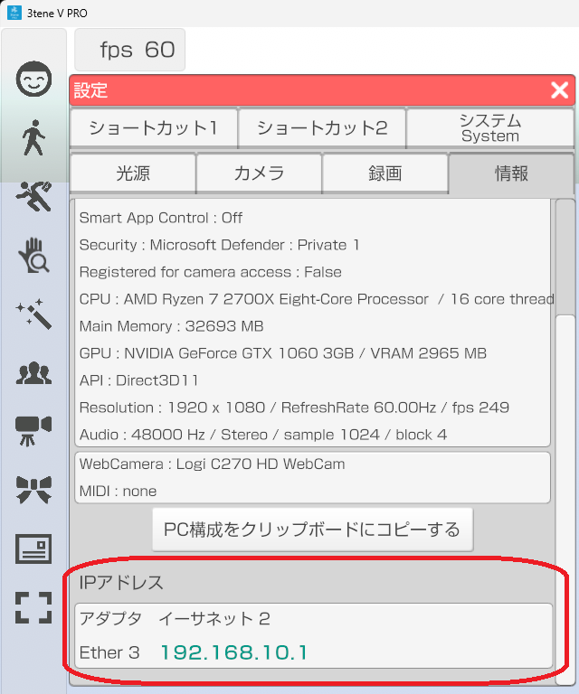
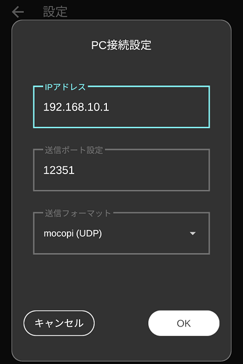
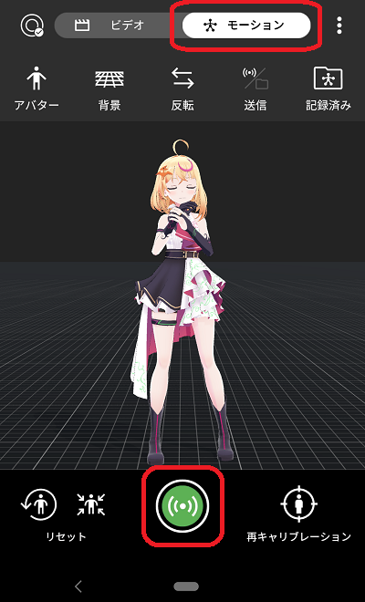
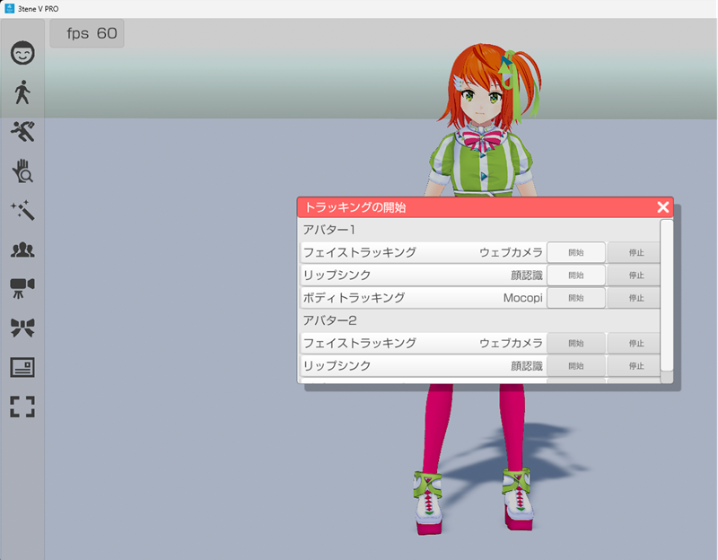

## mocopi (v5 内蔵)

>専用センサーで頭、体、腕、足を動かします。  

### mocopi 専用アプリについて

>mocopi の利用にはパソコン(PC)もしくはスマートフォンで動作する mocopi 専用アプリが必要になります。  
>\
>スマートフォン版の mocopi 専用アプリは対応スマートフォンが必須となります。  
>お使いのスマートフォンが mocopi 専用アプリに対応しているかどうかは  
><a href="https://www.sony.jp/mocopi/#spec" target="_blank">mocopi 公式ホームページ</a>にて確認をお願いします。  
>\
>※一覧にある機種よりも古いスマートフォンに専用アプリがインストールできても  
>　性能が足りず安定動作しない可能性が高いです。  
>\
>  
>  

### 使い方

>mocopi を利用するには下記の手順で進める必要があります。  
>1. mocopi 専用アプリをインストールし、mocopi が動作するのを確認する。  
>専用アプリでの動作については mocopi 公式の<a href="https://www.youtube.com/watch?v=g0d-x0l2HtA" target="_blank">動画</a>などを参照して設定をしてください。  
>
>2. 3tene をインストールしたPCとスマートフォンをWiFi接続して動作するのを確認する。  
>※セキュリティソフトによってブロックされ、通信できない場合があります。  
>その場合にはファイルウォールの確認をお願いします。  
>[セキュリティソフトについて](AboutSecuritySoft.html)  
>\
>ボディトラッキングの種類を Mocopi に変更します。
>  
>\
>3tene の設定「情報」に表示されている IP アドレスを mocopi 専用アプリに入力します。  
>  
>\
>専用アプリの操作 → 設定 → PC接続設定 → IPアドレス入力 → OK  
>  
>3tene のトラッキングを開始した状態で専用アプリから送信を行うと  
>アバターが動作するようになります。  
>\
>専用アプリの操作手順  
> → 上部の「モーション」をタップ → 下部の中央にある送信アイコンをタップ  
>  
>
>3. 3tene のトラッキングを開始して動作するのを確認する。  
>  

