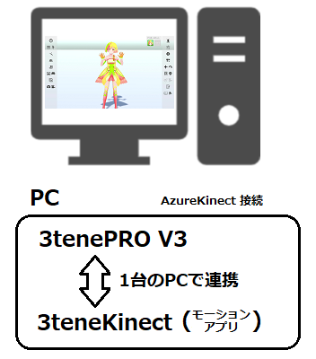
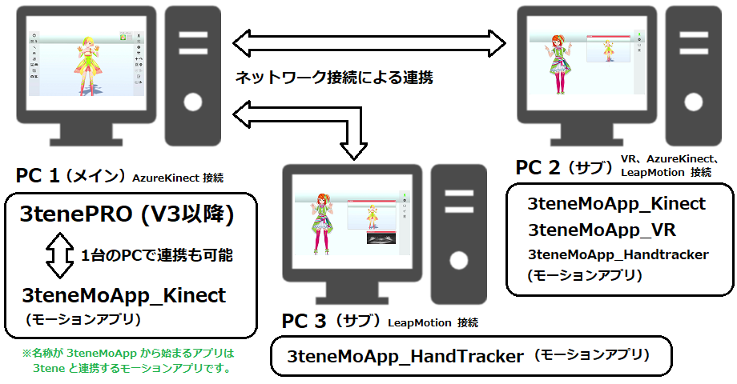
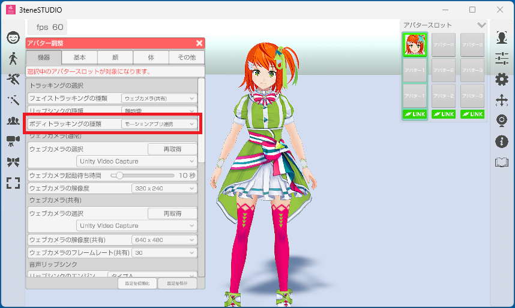
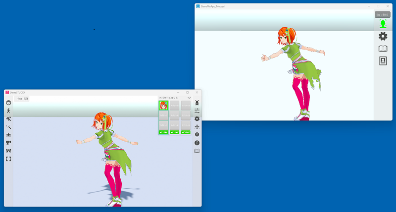

## モーションアプリ連携について

>3tene を拡張する 3teneMotionApp システムを搭載。
>3tene 本体の更新を行わずに新たな機器追加が可能になりました。

>3tene 本体とモーションアプリを連携する事でトラッキングを可能にします。
>

>3tene V3 以降では既存の Azure Kinect だけでなく、
>LeapMotion、VR、Nuitrack もモーションアプリとして追加されました。

>※3tene 本体から VR 機能を切り離したので SteamVR は起動しなくなりました。
>　（モーションアプリ連携で VR を使用する場合は SteamVR が起動します。）

>また、PC 1台に対して1台しか接続できない機器でも
>複数の PC を用意してローカルネットワークで繋ぐことで
>3tene で複数台の機器が利用可能になります。

>PC 複数台で構成する事で負荷分散も可能になります。
>

### 使い方 (アプリ連携の接続)

>1. モーションアプリを起動します。
>2. モーションアプリのトラッキングを開始して、機器が動作しているのを確認。
>3. 3tene を起動します。
>4. 3tene の「アバターの調整」の「機器タブ」を選択。
>5.「ボディトラッキングの種類」を「3teneモーションアプリ」に変更。
>
>6. 3tene のトラッキングを開始してアバターが動くのを確認する。
>　※モーションアプリとの連携（通信）が確立していればアバターが動きます。
>

### ネットワーク経由

>「アバター調整」の「設定：3teneモーションアプリ」の「IPアドレス」に
>モーションアプリを動かしているPCのIPアドレスを入力します。
>※モーションアプリの「設定：情報」にIPアドレスが表示されます。

>１台のPCで連携する場合は「IPアドレス」に 127.0.0.1 を設定してください。
>これは通信先を自分自身（ローカルホスト）にする設定になります。

>3tene のトラッキングを開始してアバターが動くのを確認する。
>※モーションアプリとの連携（通信）が確立していればアバターが動きます。

>設定が正しく行われても※セキュリティソフトにブロックされ、
>正常に動作しない場合があります。そのような場合には
>モーションアプリがファイアウォールにブロックされないように設定してください。
>[セキュリティソフトについて](#AboutSecuritySoft.md)

