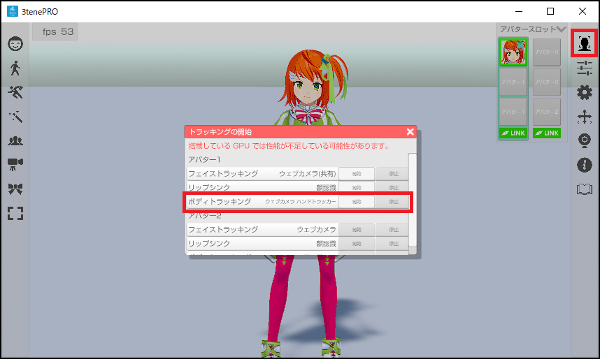

## ウェブカメラ ハンドトラッキング

>ウェブカメラでハンドトラッキングを行います。

>VR や AzureKinect 等、他の体を操作する機器との併用はできません。

### ウェブカメラの注意事項

>１つのウェブカメラでフェイストラッキングも同時に使用する場合は
>「ウェブカメラ（共有）」機能を使う必要があります。

### ウェブカメラの設定ウインドウを表示する

>3tene が起動していない状態で PC にウェブカメラを接続してください。

>ウェブカメラの初回接続時であれば汎用ドライバが自動的にインストールされますので
>インストールが完了するまで待ってください。

>3tene を起動後、アバターの調整のウインドウを開き、「機器」タブを選択します。

### 使い方

>アバター調整の「設定」タブで設定を行います。
>「アバターの操作方法」を「ウェブカメラ ハンドトラッカー」に変更します。
>フェイストラッキング(ウェブカメラ共有)も併用する場合は
>「フェイストラッキングの種類」を「ウェブカメラ（共有）」に変更してください。
>必要に応じて「ウェブカメラ（共有）」の項目の設定も変更してください。

>ウェブカメラをフェイストラッキングと同時に使用する場合は
>上半身と顔が撮影されている必要があるので大き目の解像度を指定してください。
>※解像度を大きくすると負荷が高くなります。

 

>トラッキングウインドウから「開始」をクリックしてトラッキングを開始します。

 

>ウェブカメラのプレビューはフェイストラッキングを開始して、
>フェイストラッキングのプレビューで参照する事ができます。

### 調整

>アバター調整の「体」タブで調整を行います。

 

