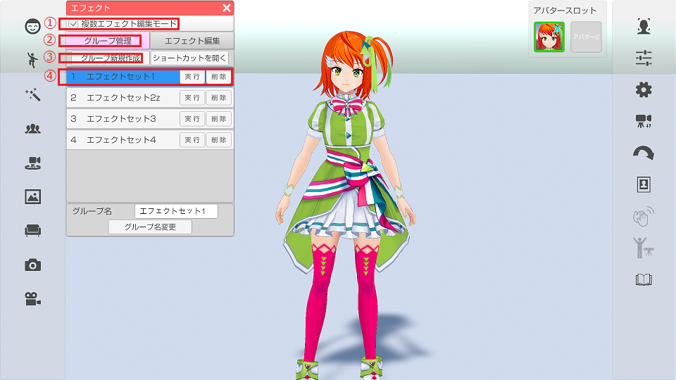
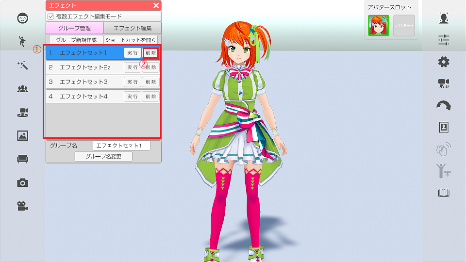
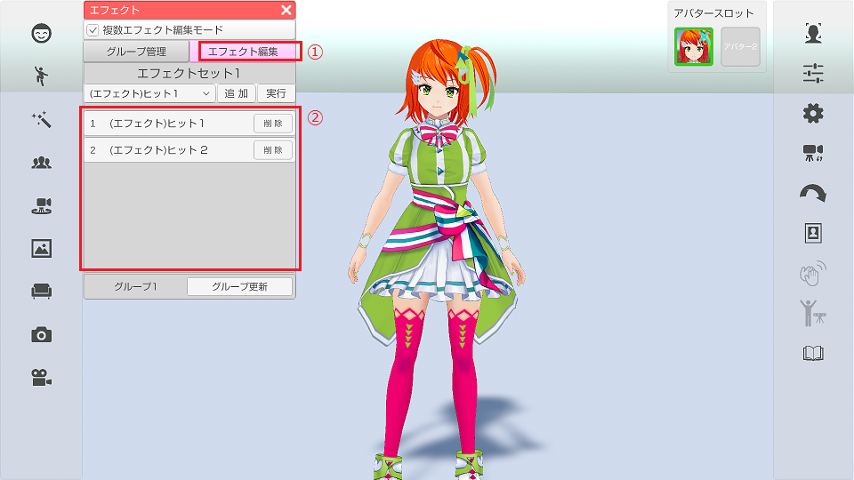
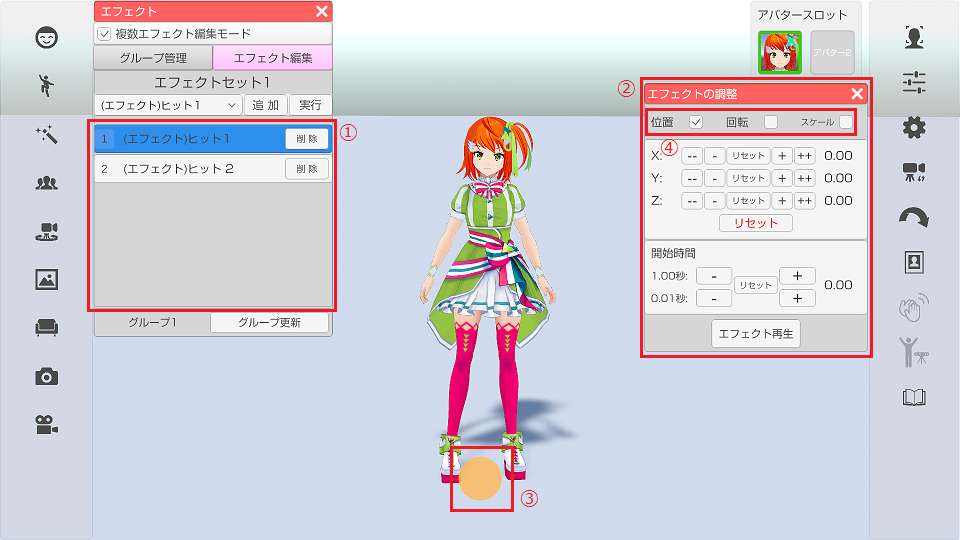
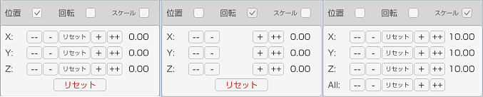
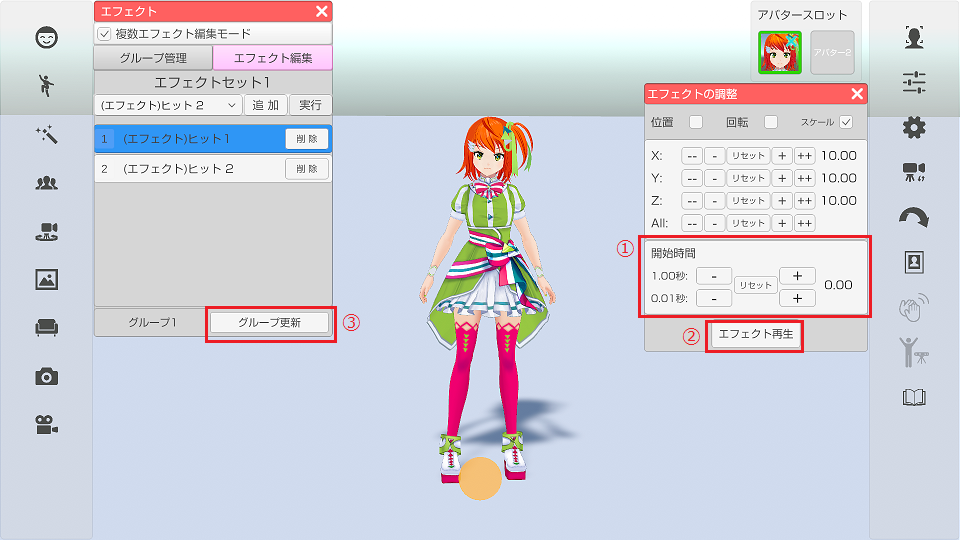
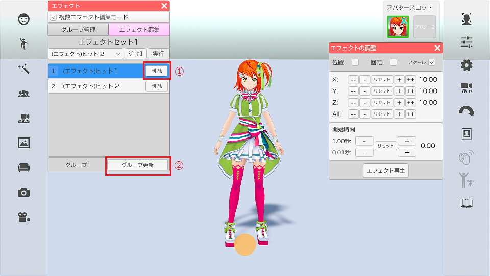
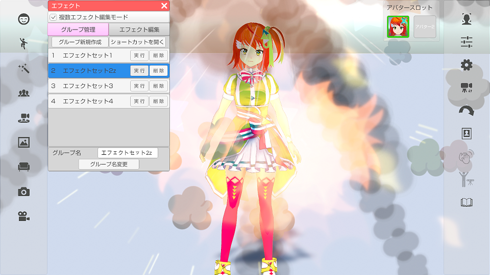
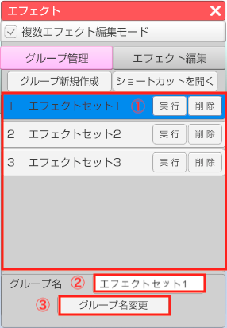

## エフェクトについて

>エフェクトを表示する事が可能です。

### エフェクトのウインドウを表示する

>左側メニューのエフェクトのアイコンをクリックするとエフェクトウィンドウが表示されます。

### エフェクトを実行する

>リストから実行したいエフェクトを選択すると
>画面にエフェクトが表示されます。

### ショートカットに割り当てる

>「ショートカットを開く」をクリックすると
>設定ウインドウの「ショートカット」タブが表示されるので
>実行したいエフェクトにキーボードやゲームパッドを割り当ててください。

***

## エフェクトグループについて

>グループを作成して複数のエフェクトを組み合わせて表示することができます。
>また、グループ内の各エフェクトの位置・回転・スケール・開始時間を設定することができます。

### 複数エフェクト編集モード

>上部チェックボックス「複数エフェクト編集モード」をチェックすることで、エフェクトグループの管理、編集を行うことができます。

### グループを作成する

>上部チェックボックス「複数エフェクト編集モード」をチェックします。画像①
>上部タブ「グループ管理」をクリックするとグループ管理画面が開きます。画像②
>「グループ新規作成」をクリックすると新しいグループ『エフェクトセット1』が作成されます。画像③, ④
>(保存中のグループの数によって初期名称の数字が変わります)
>グループが作成されると自動的に選択状態(背景青色)となります。

### 編集するグループを選択する・削除する

>上部チェックボックス「複数エフェクト編集モード」をチェックします。
>上部タブ「グループ管理」をクリックするとグループ管理画面が開きます。
>表示中のリストをクリックすると該当のグループを選択することができます。(選択されているグループの背景は青色になります) 画像①
>
>リストの右側の「削除」をクリックすると該当のグループを削除します。画像②

### グループを編集する

>グループ管理画面でグループを選択した後に上部タブ「エフェクト編集」画像①をクリックすると、エフェクト編集画面に移動して選択中のグループ内のエフェクトが展開されます。画像②

### グループにエフェクトを追加する

>上部チェックボックス「複数エフェクト編集モード」をチェックします。
>グループ管理画面でグループを選択します。
>上部タブ「エフェクト編集」をクリックします。グループ編集画面が表示され選択中のグループ内のエフェクトが展開されます。
>ドロップダウンをクリックするとエフェクトの一覧が表示されます。一覧からエフェクトを選択します。画像①
>ドロップダウンの右にある「追加」をクリックすることで、選択中のエフェクトがグループに追加されます。画像②
>ドロップダウンの右にある「実行」をクリックすることで、選択中のエフェクトを実行して確認することができます。画像③

### グループのエフェクトを編集する

>エフェクト編集画面のリストをクリックすると該当のリスト背景が青色に変化し同エフェクトのエフェクトの調整ウィンドウが表示されます。画像①, ②
>(リストがない場合はドロップダウンからエフェクトを追加してください)
>
>また、選択中のエフェクトにオレンジのポイントが表示されます。画像③
>エフェクトの調整ウィンドウ上部の位置、回転、スケールの調整したいもののチェックボックスにチェックを入れるとそれぞれを調整することが出来ます。画像④

>下記画像は位置、回転、スケールのウィンドウになります。
>「+」「-」ボタン（長押し可能）をクリックする事で値を変更します。
>「+」「-」の間のリセットボタンをクリックすると該当する軸の値を初期値に戻します。
>下部のリセットボタンをクリックすると全ての軸の値を初期値に戻します。（オブジェクトを読み込んだ時の状態）
>※スケールについては「All」のリセットで全ての軸を初期値に戻します。

>エフェクトの調整ウィンドウの下部に開始時間の設定項目があります。画像①
>「+」「-」ボタン（長押し可能）をクリックする事で開始時間の値を変更します。
>1秒ずつ、または0.01秒ずつ変更できます。
>「+」「-」の間のリセットボタンをクリックすると開始時間の値を初期値に戻します。
>
>「エフェクト再生」をクリックすると編集中のエフェクトを発生させて確認することができます。画像②
>編集が完了したら「グループ更新」をクリックして選択中のグループを更新します。画像③

### グループのエフェクトを削除する

>上部タブ「エフェクト編集」をクリックしてエフェクト編集画面を表示します。
>リストの右の「削除」をクリックすると該当のエフェクトが削除されます。画像①
>「グループを更新」をクリックして選択中のグループを更新します。画像②

### グループを再生する

>上部タブ「グループ管理」をクリックしてグループ管理画面を表示します。
>リストの「実行」をクリックするとグループに登録されているエフェクトを全て再生します。画像②

### グループの名前を変える

>上部タブ「グループ管理』をクリックしてグループ管理画面を開きます。
>リストから、名前を変更したいグループをクリックして選択状態にします。画像①
>ウィンドウ下側にあるグループ名のテキストを変更し、「グループ名変更」をクリックするとグループの名称を変更できます。画像②, ③

***

## グループのショートカットについて

>上部タブ「グループ管理」内のグループのリストの上から５つのグループはショートカット機能が使えます。
>エフェクトウィンドウ内の「ショートカットを開く」をクリックするとショートカット設定ウインドウが開きます。
>※3tene右側メニュー上から6番目の「設定」アイコンからも開くことが出来ます。
>ショートカットリストの中の「エフェクトグループ1」〜「エフェクトグループ5」にショートカットキーを設定することが出来ます。
