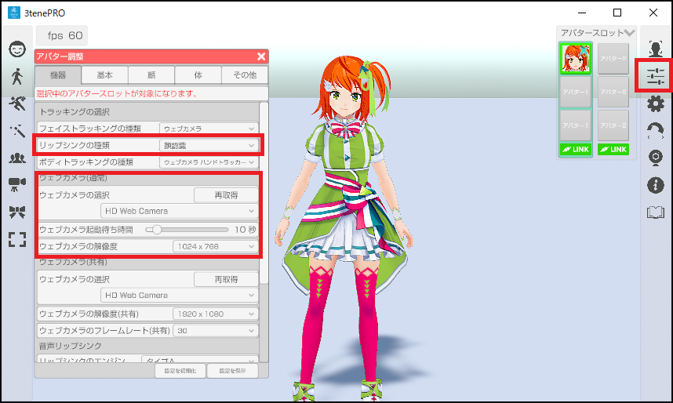
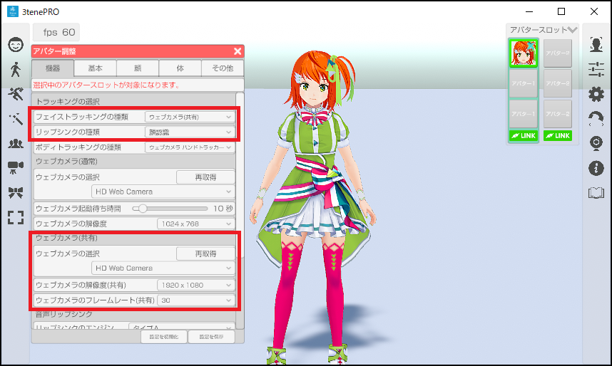
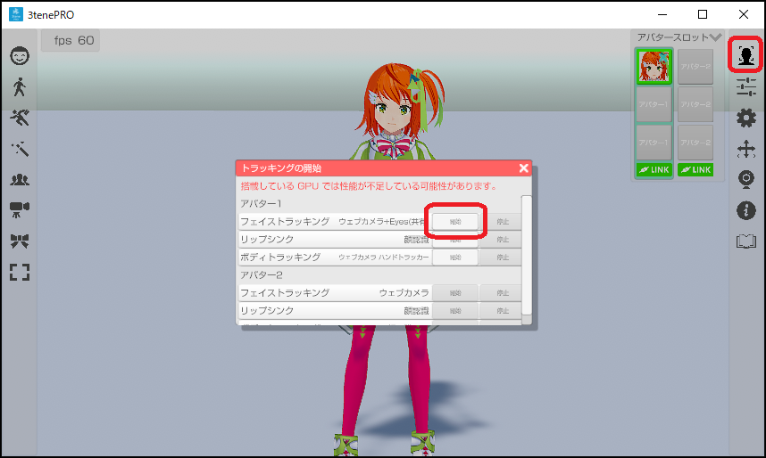
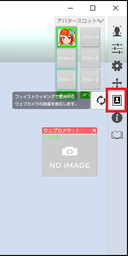
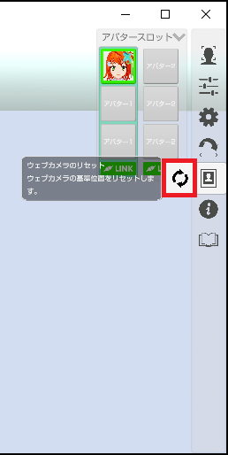
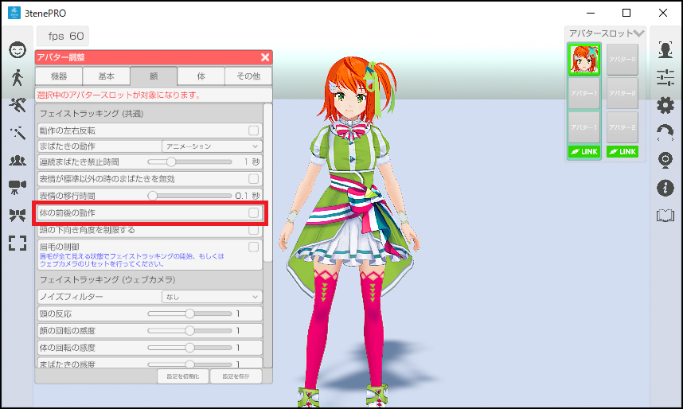
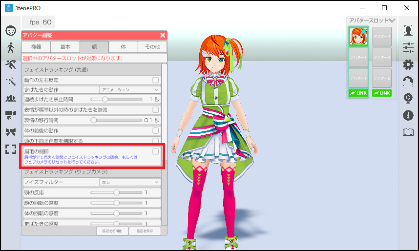

## ウェブカメラによるフェイストラッキングについて

>一般販売されているウェブカメラを使ってフェイストラッキングを行います。
>ウェブカメラ映像の解析により顔認識を行い、口、まぶた、頭の動きを反映します。

>ウェブカメラの注意事項として[こちら](#DeviceWebCamera.md)を参照してください。
>※複数のウェブカメラを同時使用する場合は必ず参照してください。

>メガネを着用していると精度の低下や認識不能が発生します。
>マスクを着用していると顔認識ができなくなります。

>3tene V3 からエンジンが複数用意されています。

|名称|機能|
|---|:---|
|ウェブカメラ|従来の 3tene と同じエンジンです。 片目のまばたきや目線を動かす事はできません。|
|ウェブカメラ(共有)|従来の 3tene と同じエンジンです。 ボディトラッキング（ウェブカメラ ハンドトラッキング）と ウェブカメラを共有します。|
|ウェブカメラ+Eyes(共有)|目のトラッキングや PerfectSync が扱えます。 従来よりも処理が重くなっています。 ※3teneFREE では使用できません。|

>※PerfectSync は 3tenePRO v4.0.2 から対応しています。
>※頭の動きはボディトラッキング (Mocopi や Perception Neuron) が優先されます。

### ウェブカメラの設定ウインドウを表示する

>3tene が起動していない状態で PC にウェブカメラを接続してください。

>ウェブカメラの初回接続時であれば汎用ドライバが自動的にインストールされますので
>インストールが完了するまで待ってください。

>3tene を起動後、アバターの調整のウインドウを開き、「機器」タブを選択します。

### ウェブカメラを設定する（通常版）

>アバター調整のウェブカメラ(通常)の項目で接続するウェブカメラを選択します。

>ウェブカメラの映像で口も動かす場合は
>リップシンク種類の項目で「顔認識」を選択します。
>必要に応じて解像度も設定します。

### ウェブカメラを設定する（共有版、+Eyes 含む。）

>※3teneFREE は対応していません。

>アバター調整のウェブカメラ(共有)の項目で接続するウェブカメラを選択します。

>ウェブカメラの映像で口も動かす場合は
>リップシンク種類の項目で「顔認識」を選択します。
>必要に応じて解像度も設定します。

### フェイストラッキングを開始する

>右側メニューのトラッキング開始のアイコンをクリックして
>トラッキング開始のウインドウを表示します。
>フェイストラッキングの開始ボタンをクリックするとトラッキングが開始されます。

### ウェブカメラの映像を確認する

>右側メニューのウェブカメラプレビューのアイコンをクリックして
>ウェブカメラの映像が表示されるプレビューウインドウを表示します。
>フェイストラッキングで正常に顔が認識されているかを確認する事が出来ます。

>※[仮想ウェブカメラ(UnityCapture)](#VirtualWebCamera.md)を使用した出力では
>　プレビューウインドウはメニューと同様の扱いとなり録画対象となりません。

### ウェブカメラの位置をリセットする

>ウェブカメラのリセットを行う事で、基準となる位置をリセットすることが出来ます。

>ウェブカメラをリセットする事で下記の計算の初期化を行います。

>・認識の基準位置
>・体の前後の動作
>・眉毛の動作

### 体の前後の動作

>アバターの調整「顔」タブの「体の前後の動作」にチェックを入れることにより、
>フェイストラッキングでアバターの前後に動かすことが出来ます。
>フェイストラッキングで使用しているカメラに顔を近づけると、
>アバターの体は前に傾き、カメラから顔を離すと、アバターの体は後ろに傾きます。

### 眉毛の動作

>アバターの調整「顔」タブの「眉毛の制御」にチェックを入れることにより、
>フェイストラッキングで眉毛動かすことが出来ます。
>※PerfectSync 対応した VRM モデルを読み込んでいる必要があります。

>眉毛は上下に動くので基準となる中心位置を決める必要があります。
>ウェブカメラのリセットを行う事で、基準となる位置をリセットすることが出来ます。

