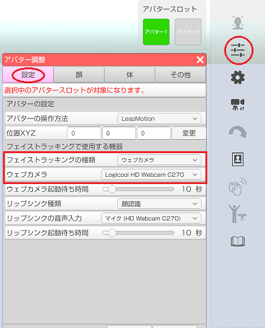
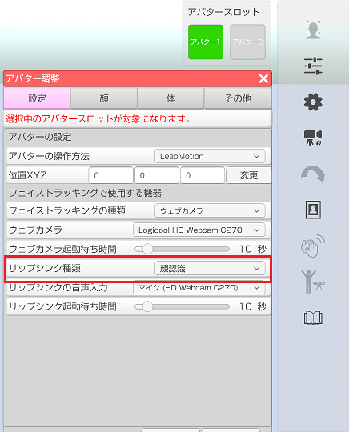
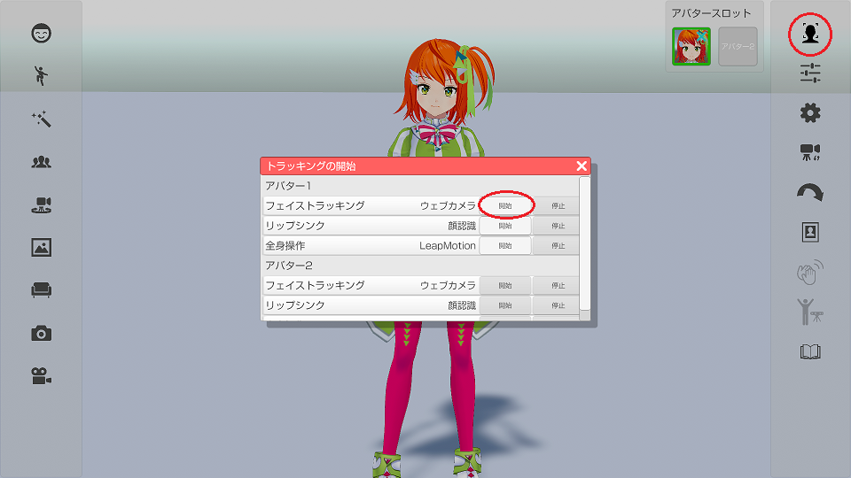
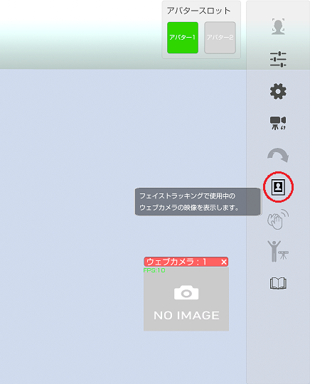
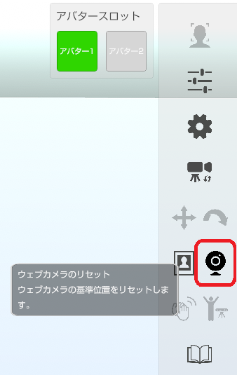
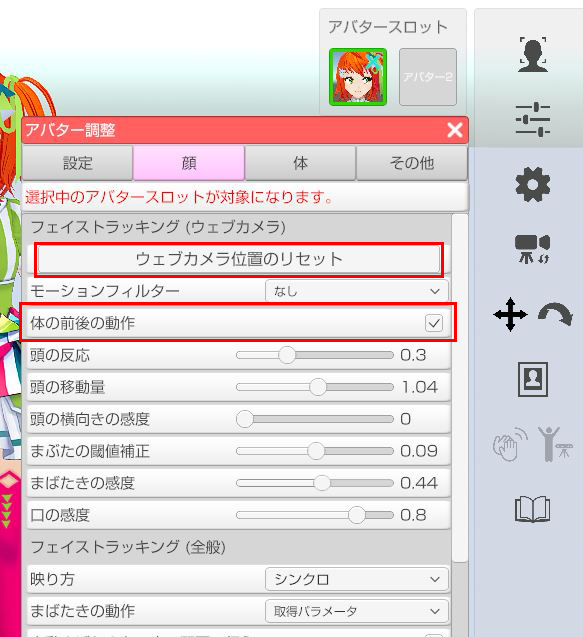
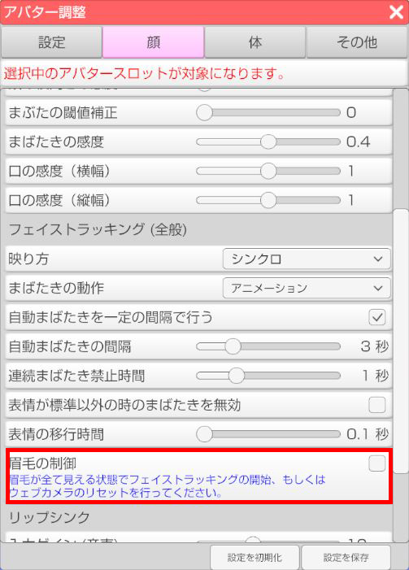

## ウェブカメラによるフェイストラッキングについて

>一般販売されているウェブカメラを使ってフェイストラッキングを行います。
>ウェブカメラで撮影された画像の顔を認識して口、まぶた、頭の動きを反映します。

>メガネを着用していると精度の低下や認識不能が発生します。
>マスクを着用していると顔認識ができなくなります。

>片目のまばたきや目線を動かす事はできません。
>※頭の動きは VR や Perception Neuron が優先されます。

### ウェブカメラを設定する

>ウェブカメラの注意事項として[こちら](#DeviceWebCamera.md)を参照してください。
>※複数のウェブカメラを同時使用する場合は必ず参照してください。

>3tene が起動していない状態で PC にウェブカメラを接続します。
>ウェブカメラの初回接続時に汎用ドライバが自動的にインストールされます。

>3tene を起動後、アバターの調整「設定」タブで接続したウェブカメラを選択します。

>ウェブカメラの撮影画像で口も動かす場合は
>リップシンク種類の項目で「顔認識」を選択します。

### フェイストラッキングを開始する

>右側メニューのトラッキング開始のアイコンをクリックして
>トラッキング開始のウインドウを表示します。
>フェイストラッキングの開始ボタンをクリックするとトラッキングが開始されます。

### ウェブカメラの映像を確認する

>右側メニューのウェブカメラプレビューのアイコンをクリックして
>ウェブカメラの映像が表示されるプレビューウインドウを表示します。
>フェイストラッキングで正常に顔が認識されているかを確認する事が出来ます。

>※[仮想ウェブカメラ(UnityCapture)](#VirtualWebCamera.md)を使用した出力では
>　プレビューウインドウはメニューと同様の扱いとなり録画対象となりません。

### ウェブカメラの位置をリセットする

>ウェブカメラをリセットする事で下記の計算の初期化を行います。

>・認識の基準位置
>・体の前後の動作
>・眉毛の動作

### 体の前後の動作

>アバターの調整「顔」タブの「体の前後の動作」にチェックを入れることにより、
>フェイストラッキングでアバターの前後に動かすことが出来ます。
>フェイストラッキングで使用しているカメラに顔を近づけると、
>アバターの体は前に傾き、カメラから顔を離すと、アバターの体は後ろに傾きます。

>ウェブカメラのリセットを行う事で、基準となる位置をリセットすることが出来ます。

### 眉毛の動作

>アバターの調整「顔」タブの「眉毛の制御」にチェックを入れることにより、
>フェイストラッキングで眉毛動かすことが出来ます。
>※PerfectSync 対応した VRM モデルを読み込んでいる必要があります。

>眉毛は上下に動くので基準となる中心位置を決める必要があります。
>ウェブカメラのリセットを行う事で、基準となる位置をリセットすることが出来ます。

