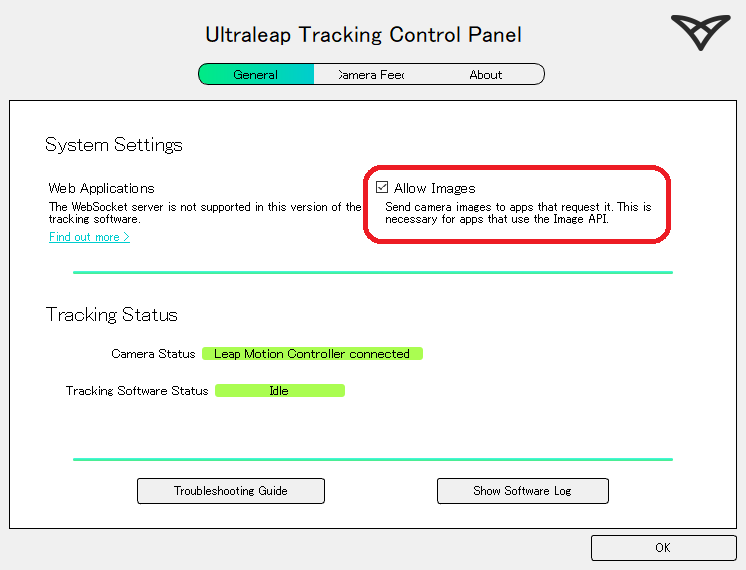
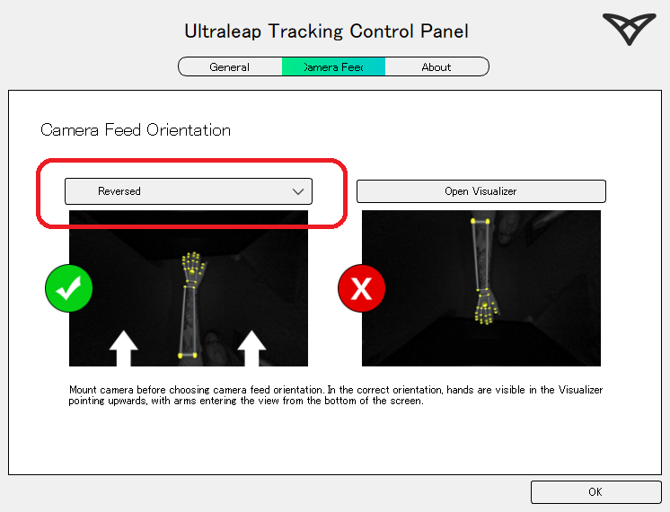
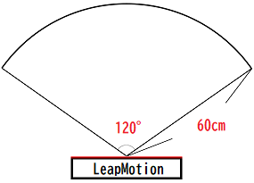
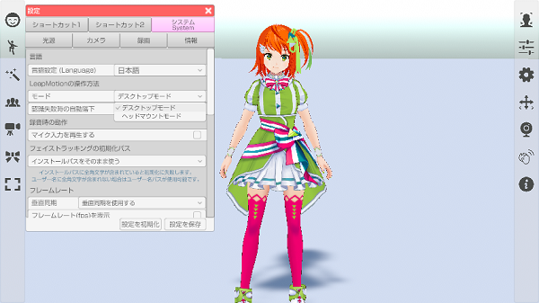
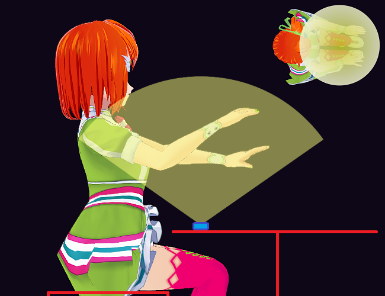
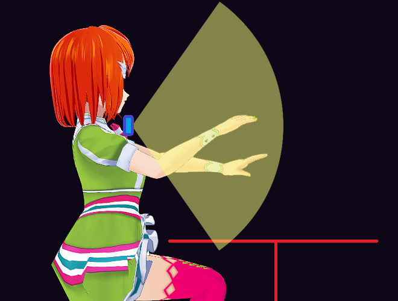

## LeapMotionについて

>専用センサーで腕、手、指を動かします。

>VR や AzureKinect 等、他の体を操作する機器との併用はできません。

### LeapMotion 専用ソフトウェアの注意事項

>LeapMotion を使用するには専用ソフトウェアが必須となっています。

>3teneが対応している専用ソフトウェアのバージョンは下記になります。

|名称|v4.x|v5.0|v5.2(Gemini)|v6.0(Hyperion)|
|:---|---|---|---|---|
|3tene v4.0.6 以降|×|×|○|○|
|3tene v2.0.18 以降|×|×|○|×|
|3tene v2.0.17 以前|○|○|×|×|

>3tene v2.0.18 以降は v5.2 以降で動作しますが、v5.0 および v4.x では動作しません。
>3tene v2.0.17 以前は v5.2 以降で動作しません。v5.0 および v4.x にて動作します。

>#### 最新(v6.0.0 以降) 専用ソフトウェア(Ultraleap Hyperion) について
>Leap Motion Controller 2 以前の製品を認識しないようです。

|名称|Gemini v5.20 まで|Hyperion v6.0.0 以降|
|:---|---|---|
|Leap Motion Controller (初代)|○|×|
|Ultraleap 3Di|○|×|
|Stereo IR 170|○|×|
|Leap Motion Controller 2|○|○|

### 新 LeapMotion ソフトウェア(v5.20 以降)のインストール

><a href="https://developer.leapmotion.com/vr-setup" target="_blank">公式サイト</a>より ultraleap-hand-tracking_v5.20.0-2024.04.24_windows.24.exe をダウンロードします。

>※ダウンロードするにはログインが必要です。

>ダウンロード完了後、インストールしてください。

>インストール完了後、Leap Motion ソフトウェアを起動します。

 

>Allow Images にチェックを付けます。
>3tene で撮影映像が表示可能になります。

 

>※「トラッキングの向きの自動調整」が無くなったので手動設定が必要です。
>使用環境に合わせて LeapMotion の認識向きを指定します。
>・default 向きを変えずにそのまま使用します。
>・Reversed 向きを逆にして使用します。

### LeapMotion の使用モードの切り替え

>LeapMotion シリーズはセンサー範囲内に手が入ると認識します。

>LeapMotion (初代)のセンサー範囲は中心角110°、半径60cmの範囲となっています。
>LeapMotion 2のセンサー範囲は中心角160°、半径110cmの範囲となっています。
 

>認識できるセンサー範囲を有効に活用する為に設置モードの変更が可能です。

>設定 - システム - LeapMotionの操作方法 - モード から
>「デスクトップモード」「ヘッドマウントモード」を変更することが出来ます。
>※ドロップダウンを変更後、モード変更完了後にアクティブに戻ります。
 

>#### デスクトップモード
>膝もしくは机の上に LeapMotion を置き、その上で腕を動かします。
>※机の上だと位置が高く、センサーの範囲内に手を収めるのが難しい場合があります。

>机の上にあるキーボードや楽器を操作するような動きに適しています。
 
 
>#### ヘッドマウントモード
>ネックマウントに LeapMotion を固定して使用する場合のモードになります。
>ネックマウントの前で腕を動かします。
>※元は VR ヘッドセットに設置していたのが名称の由来です。

>正面に対してジャンケン等、手の動きを見せたい場合に適しています。
 

### 3teneでの使用方法

> LeapMotion のソフトウェアがインストールされているのを確認してください。

> 1. LeapMotion を USB ケーブルで PC に接続します。
> 2. 3tene が Leap Motion を認識すると LeapMotion のアイコンがアクティブになります。
>    アイコンをクリックすると LeapMotion のカメラ映像が表示されます。
> 3. アバターの調整 → 設定 → ボディトラッキングの種類を「LeapMotion」に変更し、動作を確認します。
> 4. アバターの調整 → 体 → LeapMotion の項目を動きを見ながらそれぞれを調整します。

### ボディトラッキングを開始する

>右側メニューのトラッキング開始のアイコンをクリックして
>トラッキング開始のウインドウを表示します。
>ボディトラッキングの開始ボタンをクリックするとトラッキングが開始されます。

