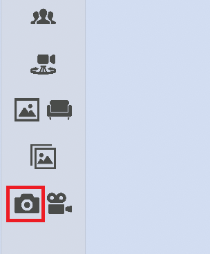
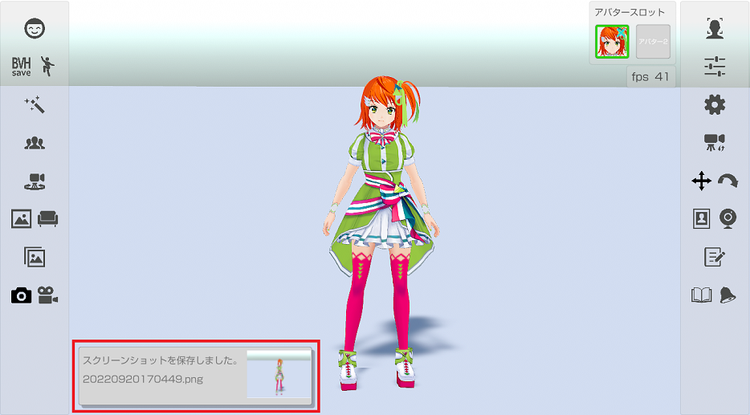

## スクリーンショットについて

### スクリーンショットで画像を保存

>左側メニューのカメラのアイコンを押して表示されている画面を画像ファイルに保存します。

>スクリーンショットをすると、スクリーンショット完了のメッセージ表示を行います。

>スクリーンショットは個人用フォルダーの「ピクチャ/3tene」に保存されます。 
>メニュー部分は存在しない扱いになるので画像ファイルには保存されません。
>※メニュー部分も保存したい場合は PrintScreen キー等、ＯＳ標準機能を使ってください。

>スクリーンショットの細かい設定は設定の「録画」タブから変更できます。
>[設定の「録画」タブ](#settingRecording.md)