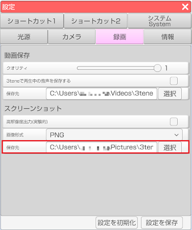

## 録画タブについて

>動画保存、スクリーンショットの設定を行います。

### 動画保存

#### クオリティの調整をする場合

>クオリティのバーを調整することで録画する動画のクオリティを調整することが出来ます。

#### 3teneで再生中の音声を保存する場合

>通常だと3tene内の音声は録画しても動画に保存されませんが、設定の「録画」タブの
「3teneで再生中の音声を保存する」にチェックを入れることで保存されるようになります。

#### 保存先を変える場合

>通常では「ビデオ/3tene」フォルダに保存されます。
>保存先を変える場合は設定の「録画」タブの保存先から「選択」ボタンで変更します。

### スクリーンショット

#### 任意解像度 (3teneFREE は非対応)

>「任意解像度」にチェックすると設定項目が表示されます。
>指定した解像度でのスクリーンショットを撮ることが出来ます。

#### 画像形式を変える場合

>設定の「録画」タブの「画像形式」で変更が可能です。
>画像形式のドロップダウンからスクリーンショットの画像形式を
JPG、PNG 形式に変更することが出来ます。

>ただし、アバターでMtoonシェーダーを使用している場合に PNG 画像で保存して
>ビューアーで表示すると頬、髪などが黒くなることがあります。

>これは透過情報を持っているためです。
>その場合は JPG 形式で保存するようにしてください。(透過情報は失われます)

#### 保存先を変える場合

>通常では「ピクチャ/3tene」フォルダに保存されます。
>保存先を変える場合は設定の「録画」タブの保存先から「選択」ボタンで変更します。

