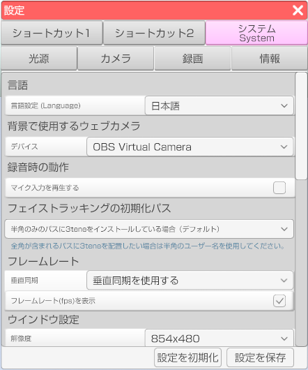

## システムタブについて

>3teneのシステム部分の設定を行います。

### 言語

>3tene内の言語を変更できます。
>日本語、英語、中国語(簡体字、繫体字)に対応しております。

### LeapMotion の操作方法 (FREE 版のみ)

>LeapMotion の操作方法の説明は下のリンク先のページに記述しましたので、そちらを確認してください。
>[LeapMotionについて](#leapmotion.md)

### 背景で使用するウェブカメラ

>ドロップダウンから背景設定でウェブカメラを使用する際のカメラの設定を行います。

### 録音時のマイク入力を再生する

>リップシンクを行う音声データを再生します。

### フェイストラッキングの初期化パス

>フェイストラッキングの初期化を行う際のパスを変更できます。
>・3teneインストール時にインストール先のフォルダを指定していない場合、インストールフォルダのパスが半角のみの場合は
>「半角のみのパスに3teneをインストールしている場合（デフォルト）」で問題ありません。
>・3teneインストールフォルダを指定しフォルダのパスに半角以外の文字が使用されている場合（ユーザー名が半角の必要あり）は、
>「半角のみのユーザー名を使用している場合」に設定してください。

### フレームレート

>・「垂直同期」のドロップダウンから3teneのフレームレートをディスプレイ・モニターのフレームレートと同期させるか設定することが出来ます。
>・「フレームレート(fps)を表示」にチェックを入れると現在のフレームレート(fps)値をアプリ上に表示させることが出来ます。

### ウインドウ設定

>#### 解像度

>3teneの解像度を設定することが出来ます。

>#### モード

>ウインドウ、フルスクリーンのいずれかを設定することが出来ます。

>#### 画面の回転

>3tene内のカメラの角度を変更することが出来ます。

>#### クオリティ

>3tene内の描画クオリティを変更することが出来ます。

### 仮想ウェブカメラ

>仮想ウェブカメラの説明は下のリンク先のページに記述しましたので、そちらを確認してください。
>[仮想ウェブカメラについて](#VirtualWebCamera.md)

### NDI設定

>NDI設定の説明は下のリンク先のページに記述しましたので、そちらを確認してください。
>[NDIについて](#NDI.md)

### その他

>#### メニューバーを自動的に隠す

>有効にすると左右のメニューバーを隠すことが出来ます。
>有効状態でメニューが表示されていた部分にマウスを移動させるとメニューが表示されます。

>#### ツールチップを表示しない

>有効にするとメニューのアイコンにマウスを合わせた際に表示される説明が表示されなくなります。

>#### アップデートがある場合は起動時に表示する

>勇往にすると起動時にアップデートの案内が表示されます。

>#### モデルの読み込み時に強制的に描画フラグを付ける

>有効にするとアバターの描画が乱れるのを防ぎます。
>※アバター読み込み時に処理するので 3tene を再起動してください。

>#### 常にチラツキ対策を行う

>有効にすると 3tene が非アクティブの際の画面のチラツキを抑える処理を常に実行します。
>※旧環境用。

>#### UI の選択判定のずれ対策を行う

>有効にすると 3tene の UI の選択判定のずれを修正します。
>※マルチディスプレイ環境で異なる解像度に設定している場合の対策です。

### 設定のインポート、エクスポート

>「エクスポート」で設定をファイルとして保存し、「インポート」で「エクスポート」によりファイルとして保存した設定を読み込みます。
>「インポート」に成功した場合、3teneが終了しますので、再起動をお願い致します。

### 全設定のリセット

>3tene内での設定保存全てをリセットし、デフォルトの状態にします。
>「全設定のリセット」をクリックすると3teneが終了しますので、再起動をお願い致します。

### UIモードの切り替え (Studio 版のみ)

>3teneのUIモードを切り替えます。
>変更した場合、3teneが終了しますので、再起動をお願い致します。